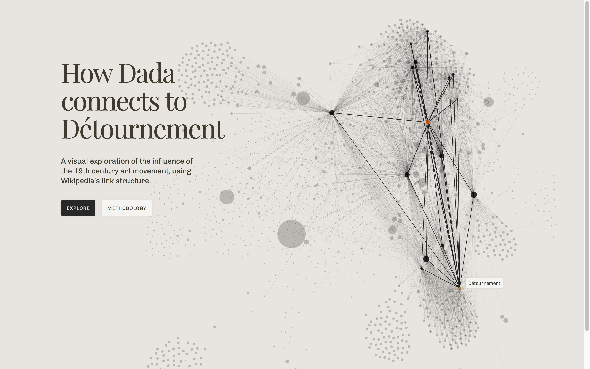

# Mapping Dada
### Charting Influence and Interconnectedness in History

[MappingDada.info](http://www.mappingdada.info)

How do we measure influence? If you allow that a link from one page to another allows us to measure relevance, ala the PageRank algorithm, and that proximity (e.g. the number of links from one page to another) gives us a sense of how that relevance diminishes with distance, ‘influence’ is only a function of chronological order. This project is a case study in applying this methodology to the art movement, Dada, using the closed network of wikipedia to provide a consistent dataset. From this dataset (the scraped URLs and basic metadata of pages linking to and from Dada) a map of the conceptual framework, players and geography of Dada is established, contextualizing the art movement within it’s moment in history.

### Features:
1. Visualized conceptual and historical ties from contemporary figures and movements to Dada.
2. Categorical sorting to isolate different components of the art movement and it’s ideological offspring.
3. Quantified strength of network nodes to gauge the most power points of influence.
4. Visually clustered offshoots based on common influences.
5. Search available article titles for specific uses.

### Details:

[Written Thesis](writing/MappingDada_MSDV_Thesis_SPR2017.pdf)

[Data Collection Codeset](work/crawler/)

[Data Structure & Analysis Codeset](work/analysis/)
