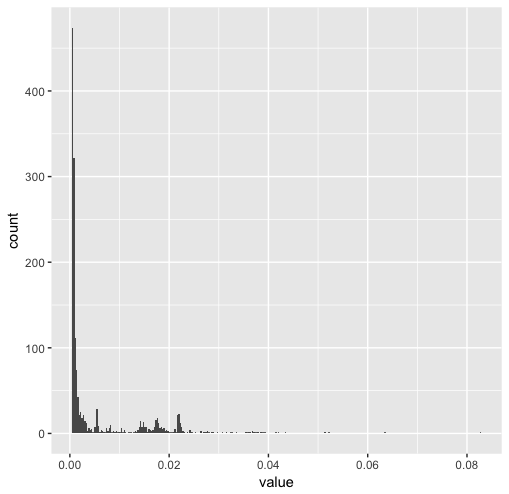
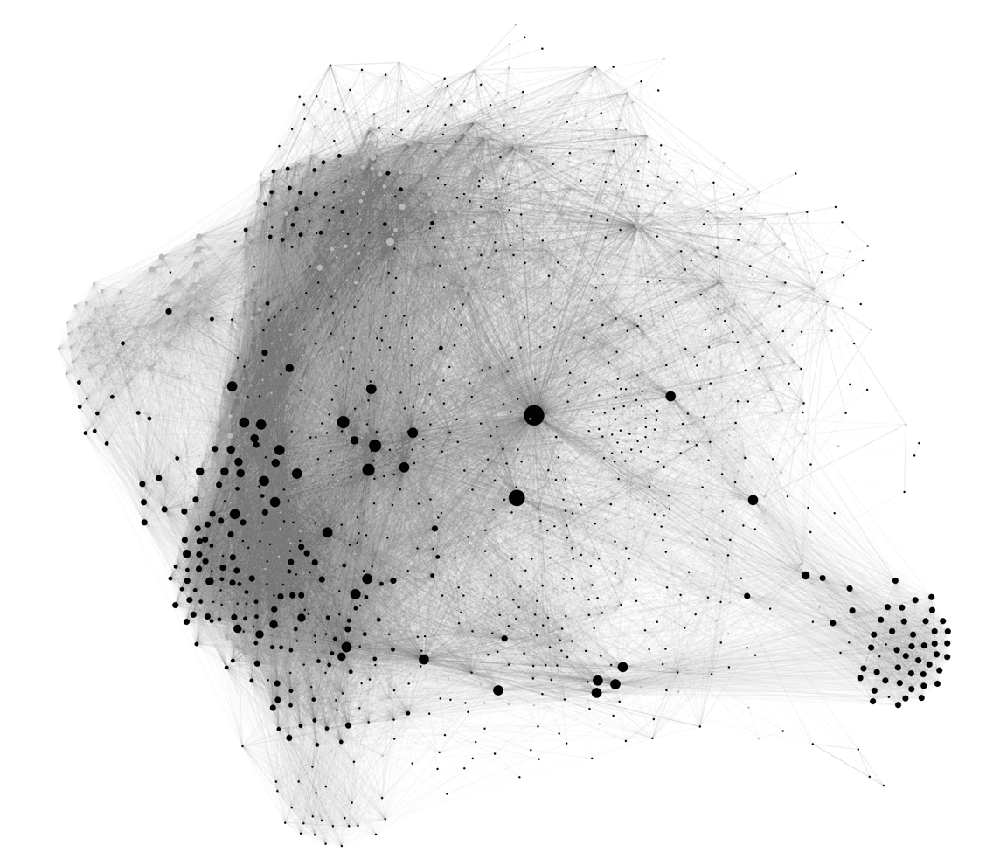
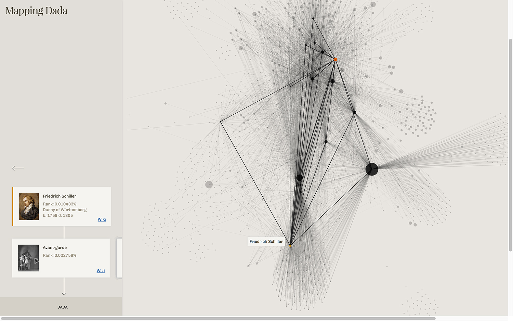
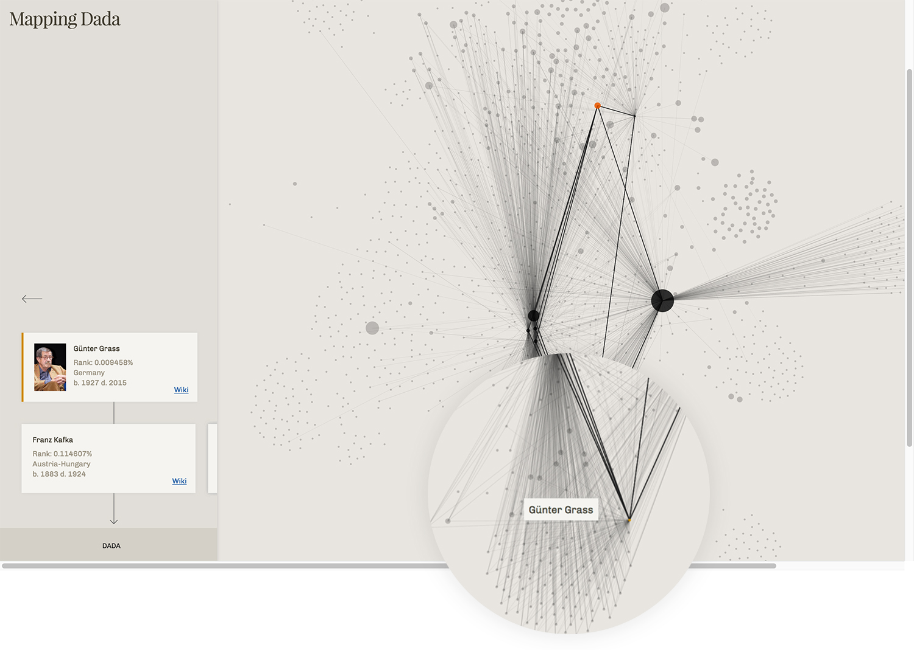
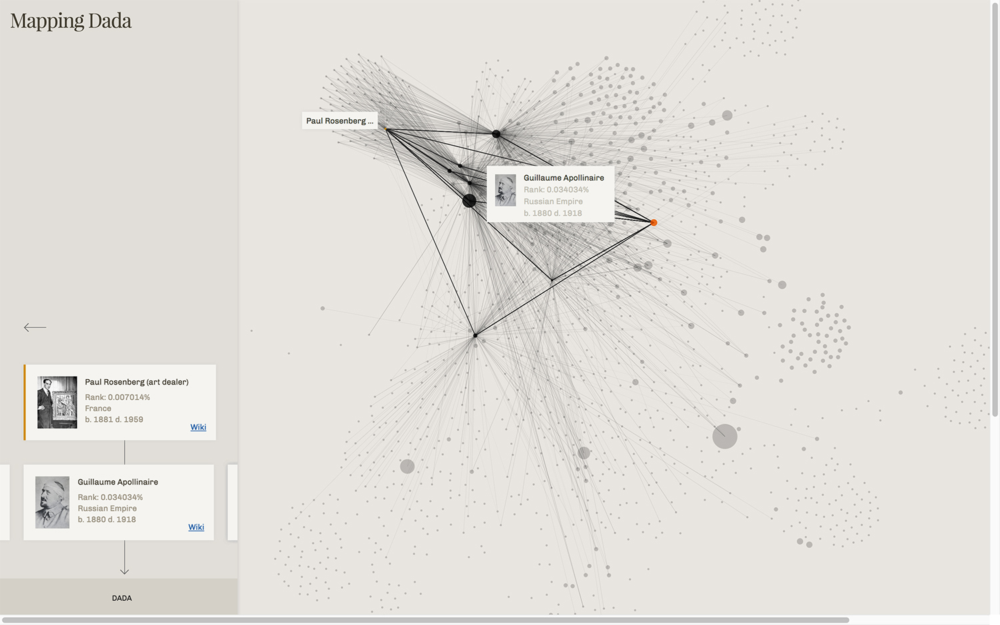
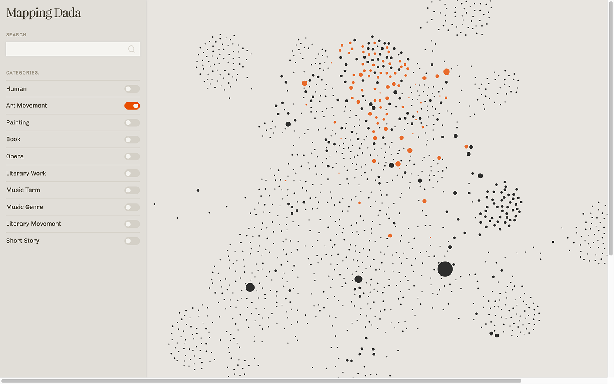

# Mapping Dada
### Charting the Interconnectedness of History

###### Riley Hoonan, Parsons School of Design <br /> MS Data Visualization Candidate 2017
–
###### Submitted in partial fulfillment of the <br /> requirements for the degree of Master Science in <br /> Data Visualization at Parsons School of Design.

<br />
<br />
<br />

#### Introduction

In recent years, the wealth of data available over the internet has given birth to new approaches to intellectual history–ones not reliant on curation by academia, but by the public (or at least those with access to the digital domain). As with all things on the internet, this data can be gathered programmatically, offering opportunities to build new metrics for concepts previously considered unquantifiable. In question here: can we map the influence of a movement on contemporary culture? In doing so, can we measure the spread of said concept? And what do the contemporary interpretations tell us about how the original idea’s shape has transformed?

I attempt to answer these questions using Wikipedia’s link structure as a data source. This underlying set of interconnections allows us to gauge the cognitive proximity of concepts, without the limitations of geographic or chronologic distance, as determined by the community of amateur researchers powering Wikipedia. In building a model, we establish a single case study to act as the central node for our influence-network: the art movement Dada.

#### 1. Background
##### 1.0 Dada as a case study for a model to track cultural influence.

Cultural influence, while not currently quantified as a metric, is actively tracked through a multitude of historic and philosophical studies: art history, cultural history, intellectual history, “The History of Thought” and even Memetics (although the persistence of this last discipline is debatable). (Kronfeldner, 2014; Grafton, 2006; Marsden, 1999)

In embarking on building a metric for cultural influence, quantifiable through link structures, Dada is chosen because it is well documented through its contemporary publications and the analyses of the aforementioned disciplines (art history etc). Dada also enjoys the distinct strength of prominence in academia whilst generally falling outside the curriculums of mainstream culture, meaning it is less likely to suffer from over-representation in Wikipedia, as is often found with pop culture and art topics (Kittur et al, 2009; Halvais and Lackaff, 2009).

Further, ongoing debate on Dada as a modernist or postmodernist movement gives us means to compare the output of the model to expected results, a sort of theoretical hypothesis to test against. In *Challenging Modernity: Dada between Modern and Postmodern,* Mark Pegrum posits Dada as a particularly early postmodernist entity, standing directly opposed to power structures, parallel but not intersecting with modernism, which seeks instead to redesign said power structures. Indeed, in the *First International Dada Fair* (1920), Dadaists cement their opposition to the establishment with posters pronouncing “Art is Dead” and "Dada is the deliberate subversion of bourgeois values.” (Dachy, 2006)

Jean Arp, a central figure in Dada, furthers these anti-establishment ideals with anti-war sentiment:

> “In Zurich, we had no interest in the abattoirs of the World War, and devoted ourselves to fine art. While the thunder of artillery rumbled away in the distance, we were putting together collages, reciting, writing verse, and singing with all our hearts. We were looking for an elementary type of art that we thought would save mankind from the raging madness of those times. We aspired to a new order that could reestablish the balance between heaven and hell.”

Dada is deeply intertwined with politics, with (some argue unwanted) ties to the Kommunistische Partei Deutschlands (Kane, 1982), Huelsenberg’s assertions that “Dada is German Bolshevism” (Motherwell, 1951), a few members labeled as anarchists (often overlapping with communists), and a general distrust, and satire, of authority. At one point, Andre Breton argues the Dadaists will declare themselves in favor of any revolution, so long as it is in opposition to conservatism. Dada earns infamy among the ranks of authority figures through a variety of art pieces and pranks: depicting a police officer as a pig in the *First International Dada Fair*; a founding of a ‘Dada Republic’ where soldiers are summoned in reaction to a non-existent revolution; photocollage satires of major political figures...the list goes on. (Dachy, 2006) In these acts of dissidence, Dada extends beyond art movement into the space of direct action and political protest, providing a wellspring of inspiration for arts-activism to come.

We should expect Wikipedia’s link structure to reflect this. Conversely, a link structure that paints Dada as a friend to authoritarian figures would be worthy of skepticism, helping establish theoretical underpinnings for validation (or rejection) of our analysis.

Dada’s final strength as subject matter is its own documentation, helping dissolve some potential for misrepresentation found with other topics more reliant on secondary sources. From Tristan Tzara’s founding of Dada in 1915, the movement quickly evolves to form cells outside of Zurich, first in Europe and then to Japan, through Murayama, and the US, where Duchamp makes his home in New York. In this international arena, Dadaist thoughts and ideals are spread via magazines and art rags of the time–first and foremost, Hugo Ball and Tristan Tzara's *Dada* magazine, but just as importantly, *Merz,* Schwitter’s periodical; *391,* from Picabia in Barcelona; *Mavo,* from Murayama in Japan, and (albeit tangentially) *De Stijl,* which, while not directly related to Dada, is a close enough cousin through it’s author Theo Van Doesenberg and his ongoing collaborations with members of the movement, often operating under his Dadaist pseudonym, “Bonset”. (Dachy, 2006) Additionally, broad art magazines of the time, the art itself and art gallery records provide strong primary sources for its study and representation on Wikipedia.

In attempting to quantify influence, it is difficult to disentangle Dada from its particular moment in history, but by relying on link analysis, we have a start: authors have diligently and specifically linked their page to or from Dada, allowing us to track the chain of concepts as they evolve rather than rely upon chronological proximity. Ideally, network analyses helps define causal relationships by isolating the path from one concept to the next. In reality, these paths are multifaceted, and Dada is itself a culmination of and reaction to it’s own contemporary histories. On a theoretical basis, it is difficult to remove Dada from it's own influences: a reaction against war, nationalism, and destruction, inspiration from the great thinkers of its epoch, such as Nietzche, Freud and Marx, (Pegrum, 2000), and of course the cross pollination of other prominent art movements of the moment, like Cubism, Futurism, Expressionism, and especially Surrealism.

##### 1.1 Wikipedia as a Data Source: Strengths and Bias

Wikipedia does present some issues beyond the scope of our data collection. Specifically in question: the ‘quality’ of articles. As noted by Mesgari et al (2014), quality in this case is constituted by, and reviewed in, several categories: comprehensiveness (within articles, and across Wikipedia as a whole), its factual accuracy, breadth and presentation. While presentation is not of particularly impactful for our analysis, (as our data is collected programmatically, not read by humans) breadth, factual accuracy, and comprehensiveness are.

In breadth, Wikipedia reports that it is 60 times larger than any other english-language encyclopedia, with well over five million articles as of this writing (Wikipedia, 2017). Although the size of an encyclopedia alone is not normally cause célèbre amongst researchers, because each article increases our sample size, it increases the power of any statistical analyses applied to said data. Wikipedia's coverage is uneven, but it’s propensity for non-traditional, up-to-date crowdsourced encyclopedic information is still helpful, (Mesgari et al 2014) in that it more readily allows us to draw connections between Dada and contemporary cultural items.

Researchers have noted an unevenness in coverage on Wikipedia. In 2008, Halavais and Lackoff compared the topical distribution of books in print (from Bowkers Books in Print) vs. topical distribution of Wikipedia articles, and found differences in representation they attribute to the Wikipedia’s ‘geek culture’<sup>1</sup>: for articles on science and general history, Wikipedia is more voluminous, whereas for medicine, less so. In the center, with similar distributions between books in print and Wikipedia articles, was ‘Fine Art’, a category presumably including Dada, implying that Dada falls within a relatively ‘safe zone’ of neither under- nor over-representation.<sup>2</sup>

Further review on gender inclusion by Reagle and Rue (2011) finds that women are underrepresented in biographies, although article length does not vary significantly by gender, thereby increasing the likelihood that while women who are present will enjoy relatively comprehensive coverage, it’s likely that some of the important female contributors to Dada are left out.

#### 2. Data collection
##### 2.0 Methodology & Schema

Data is collected using a javascript program that traverses the HTML structure of a web page and collects data from it, called a scraper. In our analyses, two types of link are included: links mapping *from* an article to the article in question, and links mapping *to* an article in from the article in question. Wikipedia’s structure conveniently gives us this option by providing a “What Links Here Page” for most articles.

Links mapping from are collected *from* within the article itself by parsing the article’s HTML and collecting anchor tag ‘href’ values that link specifically to other articles within Wikipedia.

In addition to the links themselves, categorical information associated with Wikipedia’s ‘Wikidata’ objects is also collected. Wikidata objects feature relatively unstructured categorical details per article, adhering to a key:value pair schema, where values are often arrays. As such, our collection reflects the unstructured nature of this categorical data, but allows additional analysis and classification.

Ultimately, the schema is flexible to accommodate the variety of different types of input it may or may not find on a wikipedia page, but it’s general structure is outlined in the key value pair. The data is stored in JSON format as follows, with Francis Picabia as a truncated example.

```
{ distance: 1,
  roots: [ 'Dada' ],
  url: 'Francis_Picabia',
  mapsFrom:
   [ 'Dada','Edvard_Munch','Erik_Satie','Franz_Kafka','The_Metamorphosis','Georges_Braque', … ],
  mapsTo: [ 'Cubism','Dada','Surrealism','Avant-garde','Impressionism','Pointillism', … ],
  wikiData: 'https://www.wikidata.org/wiki/Q157321',
  image: '//upload.wikimedia.org/wikipedia/en/thumb/9/9f/Francis_Picabia%2C_1919%2C_Danse_de_Saint-Guy%2C_The_Little_Review%2C_Picabia_number%2C_Autumn_1922.jpg/240px-Francis_Picabia%2C_1919%2C_Danse_de_Saint-Guy%2C_The_Little_Review%2C_Picabia_number%2C_Autumn_1922.jpg',
  title: 'Francis Picabia',
  metaData:
   { 'instance of': [ 'human' ],
     'sex or gender': [ 'male' ],
     'country of citizenship': [ 'France' ],
     'date of birth': [ '1879' ],
     'date of death': [ '1953' ],
     'place of burial': [ 'Montmartre Cemetery' ],
     occupation: [ 'painter', 'writer', 'screenwriter', 'poet' ], },
  rank: '0.010049' }
```

###### This example is greatly reduced and purely for sake of illustrating the data structure. While Picabia is included in the data set, the mapsTo and mapsFrom arrays are too large to be a practical illustration.

Line by line, we see a distance property, indicating how many links from Dada a particular item is (in this case, a distance of ‘1’ means a page is linked to directly). Second, a roots property, which allows us to programatically follow the various link paths back to their origin (Dada) to better examine their relationships. Unlike the others, this property is computed after the data is collected, from the *mapsFrom* and *mapsTo* arrays, rather than gathered from the scraper directly.

The *url* property provides a path back to the page when appended to the wikipedia url, https://en.wikipedia.org/wiki/.

*mapsTo* contains the links from Francis_Picabia to other pages; *mapsFrom* contains the links from other pages to Francis_Picabia. The example shown lists particularly small arrays, and is not true to the dataset – in practice, the *mapsFrom* array had a mean average of 22 (standard deviation of 112) unique URLs, although many exceed that, with a maximum of 1680 unique URLs in a single set. mapsTo had a more compressed range, with a maximum of 825 unique URLs, and a mean average of 68 links. Hopefully this begins to illustrate scope: for instance, with a list of 1000 collected data objects like Picabia above, assuming the same average, we would have a combined total of 90,000 URLs, not accounting for duplicates.

*title* is simply the title of the page, useful primarily for the visualization and interface. image is the collected by the scraper as the first image that it encounters on the page that is not a product of wikipedia itself, such as a logo, and like the title is gathered to assist in the construction of the graphic interface accompanying the visualization.

The afore-mentioned *metaData* property is a particularly dynamic object that transforms based upon the data readily available as described above. In this case, we see basic information about Mr. Picabia generally representative of how other humans might appear, but these objects expand and contract to contain information about locations and date; a full list of the possible key value pairs available is contained in *Appendix A: WikiData Properties.*

Last, *rank* is the calculated “WikiRank” value, described in depth in *2.21*.

##### 2.1 Initial Exclusions

Links collected for the *mapsTo* and *mapsFrom* arrays are limited to the body text of the article from which they originate; tables appearing underneath articles are not included because they are categorical in nature. Also excluded are general categorical pages, as any analysis using link structure to weight relevance would be dismantled by categories too broad to ascribe meaning (such as ‘Art’). Links to pages that are not articles themselves are excluded as much as possible: ‘Talk’, ‘User’, and ‘Portal’ pages are not included as they are more related to the structure of Wikipedia’s community than the topics themselves.

Some pages are included in the link structure but are ‘dead ends’ in the network–that is, pages may link *to* them but no pages will link *from* them. Included in this category are image pages, which do not contain the same sort of outward-bound links collected from the body text of articles, and ‘Book’ pages. ‘Wikisource’, ‘Wikiquote’ and ‘Draft’ pages are fully excluded because they lack a homogenous page structure to collect data from, or otherwise introduce more noise than signal.

Unfortunately, due to limitations in scope, non-English pages are not included in this model, although a properly language-robust model built on the same general premise would reasonably include them. Because of this, one would expect that some of the more detailed information on international players of Dada is limited in representation.

Importantly, duplicates are not recorded; the set only lists unique URLs. To clarify, in the set of all URLs in all *mapsTo* and *mapsFrom* arrays, there are duplicates, but within a single object (such as the ‘Francis_Picabia’ object from the earlier example) *mapsTo* will not have duplicates within it, and *mapsFrom* will not have dupicates within it. Between the two, there may be duplicates; e.g. Dada links directly to Picabia, and is logged in the mapsFrom array, but Picabia links to Dada, so Dada is also logged in the mapsTo array.

In essence, pages and links are curated to keep the data congruent and the model parsimonious. The guiding principles for inclusion were that links were human crafted (or in the case of ‘What Links Here’ pages, a collection of human crafted links) and part of an article, rather than discussion, or machine generated. A final list of excluded pages can be found in *Appendix B: Complete List of Exclusions.*

##### 2.20 Data Collection Process

Data collection began with the single article for Dada. While early versions of the scraper returned nearly 2000 total links in the *mapsFrom* and *mapsTo* arrays, the most refined (to better exclude the categories described above) version, last run on 4/26/2017, returned a list of 1454 urls in the *mapsFrom* array and 202 urls in the *mapsTo* array.

These urls were scraped, returning data points following the schema described in section 2.0 for each url. In the earlier, less filtered set, combining the *mapsTo* and *mapsFrom* arrays resulted in a list of 777,047 links total, of which 309,097 urls are unique.

While many steps were taken to make the scraper as scalable as possible, gathering over a quarter million data points for the analysis was not a viable option within the scope of the project, and further would likely introduce more noise than signal, making it difficult to gather insight from the collected data.

A metaphor might better illustrate the issue at hand: designing a map requires a curatorial hand in what geographic features to include and exclude. A map of a nation cannot show every nook and cranny of a creek winding through a neighborhood; similarly, this representation should be limited to the most ‘monumental’ features in the conceptual spatialization of Dada.

Establishing a more nuanced sense of ‘relevance’ allows this massive set to be filtered appropriately.

##### 2.21 Designing a Ranking Algorithm

To do this, a ranking algorithm was built. URLs were ranked using the PageRank algorithm (designed by Larry Page of Google fame), in conjunction with a penalty for distance to create a ‘WikiRank’, shown in Figure 2.a, below, to establish a hierarchy of relevance to Dada. PageRank’s values give us a sense of the proportion of links pointing at a page to the links pointing at it; pages that have many links pointing at them (*mapsFrom*) will be ranked higher, whereas pages that only point at others (*mapsTo*) will be ranked lower. (Page, 1998)

While PageRank is generally designed to be used in an iterative context, due to the closed nature of the set this was unnecessary and only compounded the relationship already made clear in a single iteration.

For the initial analysis, all of the URLs gathered so far were used to get a better sense of the scope and data included, but in future iterations, the WikiRank algorithm was only run on an *‘in-network’* set, or rather, the intersection of URLs contained in each *mapsTo* and *mapsFrom* array with the set of URLs scraped so far.


###### Fig. 2.a - ‘WikiRank’ Equation, generating a rank per page proportionate to the importance of the article and distance from Dada.
###### m is the total number of urls contained in the mapsTo current article being ranked; <br /> L is the total number of in-network URLs; <br /> mapsTo is the total number of in-network URLs for article i; <br /> And distance is the number of links away from Dada article i is (at this point in the analysis, always 1)

In PageRank, 1/L is actually replaced by the last iteration of the ranking algorithm’s rank for the page in question, wherein they are initialized using the 1/L score, but since there is only do a single iteration of WikiRank, this is simplified to only use the initial value. (Page, 1998)



###### Fig. 2.c - The distribution of WikiRank scores run on the initial scrape.

The WikiRank value, primarily proportionate to the number of *in-network* links pointing at the url in question, is immediately helpful in establishing a benchmark for importance. Looking at the distribution of WikiRank scores in **Fig 2.c,** we see that the large majority of scores fall at the very lowest end of the scale; that is, the score generated when a url only has a single in-network link in it’s *mapsFrom* array: 0.0006285. By only sharing a single link with the set in-network, it is easy to say that that these articles are more likely passing off-hand references than key entities in the Dada-relevant network.

In fact, the cutoff value for the lowest quartile is only 0.0006516, and with a median of 0.0009597, (vs. a max of 0.0828100) one can surmise that most of the urls retrieved at this early stage are not spectacularly relevant to the goal of mapping Dada, and like trees in a forest on a map of the world, should not be retained in the final representation of Dada’s cognitive geography.

Looking at a more distinct breakdown, of the only 33 URLs with more than 300 in-network links, we find a fairly intuitive output, validating the use of the WikiRank in establishing a cutoff for inclusion and exclusion in the model, passing a first test in validation.

```
[ 'Dada', 'Cubism', 'Surrealism', 'Avant-garde', 'Impressionism',
'Section_d%27Or', 'Marcel_Duchamp', 'Modern_art', 'Tristan_Tzara',
'Modernism', 'Minimalism', 'Pablo_Picasso', 'Fluxus', 'Symbolism_(arts)',
'Expressionism', 'Pop_art', 'Abstract_expressionism', 'Art_movement',
'Futurism', 'Color_Field', 'Salon_d%27Automne',
'Soci%C3%A9t%C3%A9_des_Artistes_Ind%C3%A9pendants', 'Constructivism_(art)',
'Incoherents', 'Rafael_Trelles', 'Fauvism',
'Relationship_between_avant-garde_art_and_American_pop_culture', 'Scuola_Romana',
'Guglielmo_Janni', 'Minimalism_(visual_arts)',
'Soci%C3%A9t%C3%A9_Normande_de_Peinture_Moderne', 'Bauhaus', 'Conceptual_art' ]
```

###### Output. 2.a - The output of URLs sharing 300 links with the in-network set, thereby scoring the highest WikiRank value.

#### 2.23 Distance at “2”

As such, the ranking algorithm was re-run exclusively on the in-network urls, and the top quartile of the cleaned and ranked dataset was used to power the second round of scraping. Again, limitations of scope came into play, however, and only the 5% of that top quartile was collected, selected randomly using Javascript’s random number generator. While the ultimate goal is to have a complete scrape of this top quartile, the sample data still provides a useful context for validating the model and prototyping a friendly way for a broad audience to explore the data.

The collection of that 5% is not trivial; it includes another roughly 6,000 data objects. To build the visualization, which, with the performance limitations of web browsers running SVG, (Beshai, 2017) the resulting set is once again filtered by quartile. The primary limitation of a 5% sample is the increased margin of error for WikiRank to ascribe meaningful importance to nodes that, with a full dataset scraped, would not be so.

Because the ranking algorithm is a function of in-network URLs, it can be expected that the initial nodes comprising the 5% to scrape from will be artificially inflated. Those URLs have the suffixes Guillaume_Apollinaire, Franz_Kafka, Max_Ernst, Generation_of_%2798, Rainer_Maria_Rilke, Fluxus, Sound_collage, Othon_Friesz, Conlon_Nancarrow, Robert_Desnos, Generation_of_%2727, Fugitives_(poets), Metaphysical_art, Richard_Strauss, Raoul_Hausmann, Synthetism.

#### 2.24 An overview of the in-network set, and validation of the model.

Within the final quartile of the 5% sample, including the upper quartile of the first set (where distance is equal to 1), we can begin to get a broad sense of the data collected.

Of the 1,807 items contained in the set, all but 12 have the *metaData* property. *metaData* is only gathered as available; some article types do not link to a wikidata page from which this information is gathered. Of those that do, 82.62% (1,493) contain an ‘instance of’ property, perhaps the best general category data available from the wikidata objects. Collecting a distribution of ‘instance of’ categories, we find the dataset contains at least (since we have roughly 300 mystery objects) 670 humans, 104 art movements, 60 paintings, 38 books, 34 operas, in just the top five most common categories.

The ‘humans’ offer more granular details: the most common occupations (not mutually exclusive categories) listed are writer (309), poet (193), painter (171), composer (148), and novelist (107), reasonably consistent with what we would expect from a set of Dada-relevent data objects. The full list of occupations is quite diverse, containing a litany of occupations describing a single or couple of in-network Dada-ish people, such as two ‘existentialists’ (it is unclear in what capacity this is an occupation) one 'collector of folk music' and even an ‘arms dealer’. The total number of occupations describing the 670 in-network humans is 244. While speculative, since there is no dataset to compare against, these occupations are again within the realm of an expected set from Dada, which, while technically an art movement, had writer/poets at it’s center (Tristan Tzara, Hugo Ball, etc) and reaches well beyond the artifactual in nature.

Because persons contained in the set are frequently the most well-described, we have reasonably detailed information about their locations via countries of citizenship and/or countries of origin. Using this information, a literally geographic view of the in-network set is available. France and Germany are nearly equal in their representation, with 133 and 132 “residents” respectively; the United States follows closely behind with 104; again, encouraging in the validation of the model’s ability to gather and filter conceptually relevant information - France and Germany, as the cradle of the movement, should represent the mode; the United States, harbor to the New York City Dadaists led by art celebrities Duchamp and Man Ray is easily qualified as a secondary but still prominent location. (Dachy, 2006)

Perhaps the best testament to the model’s accuracy is the distribution of birth and death dates, which follow a normal distribution could be a future source in comparing different topical analyses from the model (for instance, comparing the average birth date ranges of persons gathered from a central node of ‘Cubism’ vs. ‘Dada’, using a hypothesis test).

While the histogram is truncated to include a few outliers at either end, the distribution around 1890’s/1900’s as the mean decades of birth for the in-network set implies that we have successfully limited the set to Dada-relevant contemporaries, perhaps too much so.

###### Figure 2.d


Men appear to be over-represented in the dataset; they comprise 601 of the persons included, with women only representing just over a tenth of the population (68 articles) and a single transgender woman. No data about more nuanced gender identity are available with the current collection. This unfortunate proportion reflects disparities noted by Reagle and Rue in their study of the presence of women on Wikipedia.

#### 2.3 Conclusions on the model

Ultimately, it appears that the model successfully filters and ranks links based on relevance. But, in terms of the initial metric in question, cultural influence, we have so far come up short. The issue of establishing causality becomes a difficult problem, with a dataset that often does not elicit a clear sense of chronology beyond the ‘human’ category outlined above.

It is also possible that as a function of curating the dataset into the highest ranking quartile, the model limits its own capacity to draw precarious conclusions about Dada’s influence, although this is arguably a feature rather than a bug. It could also be that the distance penalty in the ranking algorithm is too harsh.

#### 2.4 Improving the dataset

This early prototype relies on a reasonably simple methodology to collect and rank sources. While the PageRank algorithm provides a powerful metric, the fidelity of the dataset – dates especially – could be improved with the integration of Natural Language Processing (NLP) technology. Javascript libraries for NLP, like compromise, offer word tokenizing features and basic semantic analysis. However, testing small samples of the article corpus against compromise quickly showed several key difficulties in using such an engine. Compromise clearly advertises their accuracy as 84-86% on Penn, (Kelly) and natural also points out their current state of development, which offers up more questions than answers: what is an acceptable degree of error on content recognition in a knowledge product? A content error that is drastic to a human  (mistaking a four digit number like “3080” as a year, for instance, or mislabeling the gender of a human based on assumptions about the name) is easily made by a algorithm, but errors of this nature would rightly undermine trust in the analysis.

Therefore, custom NLP engines, thoroughly tested, are warranted. Python’s Natural Language Toolkit (NLTK) (Bird et al, 2009) offers a myriad of word recognition features, and it’s possible that something as simple as a bag-of-words (4.2. Feature extraction) analysis using distribution of years mentioned in an article could give us the desired time series data per article. Additionally, with a corpus, a Jaccard Coefficient could be used in the process of measuring relevance. (Tan et al. 2005) Further use of machine learning algorithms could reasonably identify various other classifications that would enhance the set, and allow for better congruence among the data collected (e.g. identifying the various names of countries and relegating them to the same name for analysis). While such data processing unfortunately fell out of the scope for what was achievable within the thesis timeframe, a 2nd or 3rd iteration of data collection may see them integrated.

Further, Wikipedia, to it’s credit, is not static. A final iteration of the data collection process would be one that continuously updates directly from Wikipedia rather than relying on data scraped at specific times. Further, a cloud-based repository for that information would allow a more dynamic visualization. In building the current prototype, the full scope of URLs that would be even within the second-degree network of Dada was not evident until the first scrape was achieved. To build a truly robust analytical tool for the massive dataset mentioned, a database is the second-best solution; a direct line to Wikipedia’s database being the first.

### 3. Visualization

#### 3.0 Network Visualization as a Tool: Strengths and Challenges

> “The graphic is no longer the ‘representation’ of a final simplification, it is a point of departure for the discovery of these simplifications and the means for their justification. The graphic has become, by its manageability, an instrument for information processing.”

As Jacques Bertin expounded above, network analysis has the unique feature of being a visual-first approach, and is the intuitive method of visualizing the dataset at hand. Others have answered similar questions with similar approach; perhaps most notably, the now-defunct New York Times Research Labs’ Cascade project, (NYT Labs, 2011) which traced the ‘life’ of a story as it moved through social media, posits a similar question (regarding how information moves through influencers) and answers it eloquently.

Semaspace, created by Dietmar Offenhuber and Gerhard Dirmoser, for Ars Electronica, also addresses a similar challenge. He describes it as a “compact graph editor and browser for the construction and analysis of knowledge networks.” Semaspace deals with the magnitude of the dataset effectively by allowing enhanced details of network nodes to appear and vanish on click.<sup>3</sup> In a similar vein, Chris Harris’ clusterball uses dendrograms to effectively illustrate first-degree links of knowledge graphs within Wikipedia. (Offenhuber, 2006; Harris)

These two solutions to similar problems above illustration many of the challenges of network graphs; labels especially become an issue. As nodes in force-directed layouts inevitably overlap, leading to difficult decisions in interface design: what should be shown and hidden via click and hover states; how will users navigate; etc.

One strategy is reduction: It is tempting to believe that there are simple subsets that could be drawn out; for instance, by isolating art movements from the rest of the network, what may we see? Unfortunately, we would be faced mostly with broken connections. As Christopher Alexander asserts in his famously titled essay, “A City is Not a Tree,” and neither, it turns out, is a hypertext network of intertwined categorical relationships.

The metaphor extends into the nature of the sets and categories: the Dada-Wikipedia network does not convey a hierarchical structure, is not mutually exclusive and often overlaps, leaving no clear designation for ‘child’ and ‘parent’. Indeed, the irony of declaring a ‘central node’ such as Dada in such an analysis is the nature of hypertext link structure is inherently decentralized (Lima, 2006).

However, it is this decentralized structure that gives network diagrams the technical advantage as a format, as Manuel Lima more eloquently elaborates, in *Visual complexity: mapping patterns of information:*

> “While there are millions of information-embedded web pages online, they are, in most cases, unable to automatically extract knowledge from their inherent interconnections. A single neuron is insignificant, but as it communicates with thousands of neighbors through synapses, it suddenly becomes part of a whole, much bigger than the sum of its parts.”

That is to say, the (primary) insight is not contained within a single node or even it’s connections but in the network established between them.

On the one hand, this is a difficult complication to contend with: network graphs, in their awesome complexity, often confront the audience with an overwhelming amount of information, becoming overstimulating barriers.

#### Figure 3.a - Early Iteration of the Dada Network



In the early phases of exploration of the Dada network visualization, this nearly impenetrable wall is inherent to the form. Although some relationships begin to emerge, as shown in *Figure 3.a,* the chart is overwhelmly signaling one thing: fish. Humor aside, the visual noise and double-entendre is not ideal for any audience; the chart disqualifies itself by accidentally mimicking Tufte’s most despised duck.<sup>4</sup>

In introducing the improper signal of the fish, and addressing the issue of complexity, visual reduction is sought. It is from this iteration and critique thereof that the solution of showing only limited amounts of the network at once is introduced; hiding the lines also allows the interactions to run much smoother, as it appears the anti-aliasing of the lines put a heavy computational load on the processor.

##### 3.1 Analysis from the visualization

The visualization uses a force-directed engine to determine the positioning of the nodes as provided by Mike Bostock’s D3 force library. Essentially, nodes are positioned relative to the amount of links they have in common. (Bostock, 2016) This results in a graph that clusters similar objects based on connective commonality; when a group exhibits a large degree of common links with each other but less so with the set at large, it branches off, like the fish’s tail, above. Some of the clusters in the final visualization are undoubtedly a product of the limited sample size, as the groups connect through a tenuous single or double set of of nodes linking directly back to Dada. In some cases, it’s likely these clusters will disappear as more data is gathered, due to either being outranked by more relevant articles or becoming more intertwined with the complete set.

For instance, in the lower right, we have literary devices and genres, some of which should be marked for exclusion before the next scrape: Fan fiction, Literary Tropes, Theatrical Adaptation and Translation as perhaps undesirable data due to their lack of specificity, intermixed with a few Poets and other more ‘narrow’ subjects likely pulled into the group from commonality with the categorical descriptors.

While this is not a desirable cluster, it is a good illustration of the challenge associated with building a model of this nature and establishing a clear definition of topics too broad to give meaning vs. topics that lend insight.

The Fugitives and Southern Agrarians are the roots of another cluster towards the bottom right, of perhaps incidental Southern Universities and related entities.

###### Figures 3.b & 3.c: How Schiller and Grass connect to Dada





Nobel-prize winning novelist Günter Grass exhibits a strong, if secondary, relationship to Dada, through Kafka, Robert Musil, Rainer Maria Rilke, and Thomas Mann, among others, all of whom predate him by a full generation. Günter is joined in this bottom-most cluster by other German, Post-War literary figures, like Heinrich Böll and Paul Celan. Nearby resides the Romanticist Poet Friedrich Hölderlin, linking directly to nearly every dot in the cluster despite having practiced nearly 100 years prior to any of the post-war figures, illustrating conceptual proximity despite his chronologic distance.

Strauss, represented by the large dot near the lower left, leads to several clusters, some of which may be present due to Strauss’ outsize power as one of small sample of pages scraped for second degree relationships. Nearly directly below him, a small cluster of Austrian opera-related figures: Franz Salmhofer, Egon Hilbert, Heinrich Reif-Gintl, among others; generally with ranks in close range of 0.0025, barely above the quartile cutoff, and likely no longer included once the full dataset is collected.

To the left of the Austrian opera cluster, a similar cluster powered by the strength of the Strauss-Dada connection emerges, a galaxy mostly made up Strauss compositions and performances, some with precariously low ranks and again likely to disappear with the collection of a full set.

###### Figures 3.d: Picasso Cluster, with Rosenberg clicked state and Apollinaire hover state



Continuing in a clockwise direction, the cluster in the upper left is composed of Picasso-powered connections less tenuous in WikiRank and qualitative relevance. Paul Rosenberg, art dealer and champion of Cubism, is connected through his network of icons including Apollinaire and Stravinsky among those he directly represented in his practice (Braque, Picasso, Matisse, among others). He is accompanied in the cluster by various Picasso museums and art pieces.

###### Figures 3.e: Art Movements highlighted in orange



Having come full circle, our attention is drawn to the center of the map, where most of the largest nodes congregate. Applying the ‘art movement filter,’ it is easy to see that the most relevant articles to Dada by the WikiRank metric are it’s immediate contemporary equivalencies: Fauvism, Futurism, Expressionism are all closely related in this family of late 19th Century / early 20th Century artistic elaboration; Surrealism exhibits a particularly strong connection, consistent with the especially close proximity of those two movements and ongoing conflict between Duchamp and the Surrealists. (Dachy, 2006)

Despite the challenges of the dataset alluded to in section 2.3, it is fair to say that the visualization provides a previously unavailable view of the interconnectedness of history and only stands to improve. Where the data can and will grow in comprehensiveness, the visual helps complete the analysis and offers a uniquely, digital tool for what has traditionally been a decidedly analogue domain.

The final interactive in it’s current prototype state (June 2017) is available at MappingDada.info, where it will be continually updated in the coming months for increased usability and the afore-mentioned holistic dataset.

### Footnotes

1. The phrase ‘geek culture’ is used first by James Wales, the founder of Wikipedia, in his Wikimania 2006 keynote address: "We are stronger in science than in many other areas. we come from geek culture, we come from the free software movement, we have a lot of technologists involved. that’s where our major strengths are. We know we have systemic biases.” (Halavais and Lackoff 2008)

2. Mesgari et al (2014) argues that over representation should not be considered an issue for encyclopedias, as previous encyclopedias were edited for brevity so they could fit within the confines of print. While this is possibly true, over representation of a topic in link analysis poses an increased possibility of spurious connections.

3. Unfortunately, the API with which Semaspace relied on is no longer working and the project is only viewable in demo footage. Manuel Lima also addresses this common problem in Visual Complexity: Mapping Patterns of Information, referring to the problem, one where items frequently appear and then disappear from the internet, as a product of being in the early days of the internet, or rather, the ‘digital Dark Ages.’

4. In Tufte’s book, The Visual Display of Quantitative Information, he references a building that looks like a duck as a metaphor for “chartjunk.” Tufte quotes from Learning from Las Vegas: “It is all right to decorate construction but never to construct decoration.”

### Appendix A: WikiData Properties

Listed here are all possible properties for the wikiData object, described in segments. Please keep in mind that any single object may have some or none of these. No object would have all, as some are exclusive to the type of content in the page (eg, a person, book and event would all return different properties).

Date properties (always cleaned to contain only year, for consistency)
```
'Inception', 'publication date', 'date of birth',
'date of death', 'first performance'
```

Location properties:
```
'location', 'sovereign state', 'coordinate location', 'country',
'located in the administrative territorial entity', 'country of origin',
'country of citizenship', 'place of birth', 'place of death', 'place of burial'
```

Miscellaneous (not used in the current analysis but gathered for future reference):
```
'occupation', 'sex or gender', 'languages spoken, written or signed',
'image', 'pseudonym', 'educated at', 'given name', 'part of', 'influenced by'
```

Categorical property:
`'instance of'` - The majority of metaData objects have this property, which provides the data for the categorical filters in the visualization.


### Appendix B: Complete List of Exclusions
URLs listed shown would normally include the wikipedia prefix: https://en.wikipedia.org/wiki/

**Urls including the following strings were excluded:**
```
'Special:' 				             // Wikipedia structural page
'Category:' 				          // Denotes broad categorical pages
'Ex.php?' 				            // Generates errors in data collection
'Help:'					              // Denotes ‘help’ pages for Wikipedia users
'Wikipedia:LIBRARY'			      // Not relevant to analysis
'Public_domain'				        // Information page re: Public_Domain
'Wikipedia:Citation_needed' 	// Information page for Wikipedia Users on Citations
'File:Wikiquote-logo.svg'			// Logo image
'File:Commons-logo.svg' 			// Logo image
"_modern_and_contemporary_"		// Pages containing this phrase overly categorical or broad
'_talk'					              // Wikipedia structural page (User chat logs)
'Talk:' 					            // Wikipedia structural page (User chat logs)
"Book_talk:",				          // Wikipedia structural page (User chat logs)
'Template:',				          // Wikipedia structural page
'Wikipedia:',				          // Wikipedia structural page
'Wikipedia_talk:',				    // Wikipedia structural page (User chat logs)
'User:',					            // Wikipedia structural page
'Portal:',				            // Wikipedia structural page
"Wikipedia:Verifiability",		// Wikipedia structural page
'w/index.php?',				        // Generates error
"Index_of_",				          // List of links; overly broad; appears to be machine-generated
"List_of_",				            // List of links; overly broad; appears to be machine-generated
"_century",				            // List of links; overly broad; appears to be machine-generated
"Glossary_of_",				        // List of links; overly broad; appears to be machine-generated
"Culture_of_",				        // Overly broad (usually nation or population specific)
"History_of_",			          // Overly broad (usually nation or population specific)
"Timeline_of_",				        // Overly broad (usually nation or population specific)
"Es.wikipedia.org",			      // Foreign Language
"De.wikipedia.org",			      // Foreign Language
"Ja.wikipedia.org",			      // Foreign Language
"Fr.wikipedia.org",			      // Foreign Language
"nl.wikipedia.org", 			    // Foreign Language
"Wikisource.org",			        // Foreign Language
"International_Standard_Book_Number",	// ISBN Data
"Wiktionary.org",				      // Non-wikipedia link
"_(disambiguation)",			    // Wikipedia structural page generated for articles with similar names
"Draft:",					            // Pages in working draft mode
"21st-century_",				      // Overly broad (usually nation or population specific)
"20th-century_",				      // Overly broad (usually nation or population specific)
"19th-century_",				      // Overly broad (usually nation or population specific)
"18th-century_",				      // Overly broad (usually nation or population specific)
"World_War_",				          // Overly broad (too expansive)
```

**These articles are excluded explicitly, due to their expansive breadth:**
```
"Art",
"Visual_arts",
"Art_movement",
"Poetry",
"Performance_art",
"Abstract_art",
"Painting",
"Poet",
"Theatre",
"Sculpture",
"Satire",
"Artist",
"Literature",
"French_literature",
"Art_history",
"Art_of_Europe",
"Art_of_Asia",
"Art_of_America",
"Western_painting",
"Cultural_movement",
"Colonialism",
"Irrationality",
"Fascism_and_ideology",
"Comedy_(drama)",
"Retrospective",
```

**Additionally, a complete list of country level articles retrieved from Wikipedia’s list of sovereign states (https://en.wikipedia.org/wiki/List_of_sovereign_states) is excluded to avoid drawing spurious connections:**
```
"United_Nations_System","Member_states_of_the_United_Nations","List_of_sovereign_states#Abkhazia","Afghanistan","Albania","Algeria","Andorra","Angola","Antigua_and_Barbuda","Argentina","Armenia","Australia","Austria","Azerbaijan","The_Bahamas","Bahrain","Bangladesh","Barbados","Belarus","Belgium","Belize","Benin","Bhutan","Bolivia","Bosnia_and_Herzegovina","Botswana","Brazil","Brunei","Bulgaria","Burkina_Faso","List_of_sovereign_states#Myanmar","Burundi","Cambodia","Cameroon","Canada","Cape_Verde","Central_African_Republic","Chad","Chile","China","List_of_sovereign_states#Taiwan","Colombia","Comoros","Democratic_Republic_of_the_Congo","Republic_of_the_Congo","List_of_sovereign_states#Cook_Islands","Costa_Rica","List_of_sovereign_states#Ivory_Coast","Croatia","Cuba","Cyprus","Czech_Republic","List_of_sovereign_states#Korea_North","List_of_sovereign_states#Congo.2C_Democratic_Republic_of_the","Denmark","Djibouti","Dominica","Dominican_Republic","East_Timor","Ecuador","Egypt","El_Salvador","Equatorial_Guinea","Eritrea","Estonia","Ethiopia","Fiji","Finland","France","Gabon","The_Gambia","Georgia_(country)","Germany","Ghana","Greece","Grenada","Guatemala","Guinea","Guinea-Bissau","Guyana","Haiti","List_of_sovereign_states#Vatican_City","Honduras","Hungary","Iceland","India","Indonesia","Iran","Iraq","Republic_of_Ireland","Israel","Italy","Ivory_Coast","Jamaica","Japan","Jordan","Kazakhstan","Kenya","Kiribati","North_Korea","South_Korea","List_of_sovereign_states#Kosovo","Kuwait","Kyrgyzstan","Laos","Latvia","Lebanon","Lesotho","Liberia","Libya","Liechtenstein","Lithuania","Luxembourg","Republic_of_Macedonia","Madagascar","Malawi","Malaysia","Maldives","Mali","Malta","Marshall_Islands","Mauritania","Mauritius","Mexico","Federated_States_of_Micronesia","Moldova","Monaco","Mongolia","Montenegro","Morocco","Mozambique","Myanmar","List_of_sovereign_states#Nagorno-Karabakh","Namibia","Nauru","Nepal","Kingdom_of_the_Netherlands","New_Zealand","Nicaragua","Niger","Nigeria","List_of_sovereign_states#Niue","List_of_sovereign_states#Northern_Cyprus","List_of_sovereign_states#Korea_North","Norway","Oman","Pakistan","Palau","State_of_Palestine","Panama","Papua_New_Guinea","Paraguay","Peru","Philippines","Poland","Portugal","List_of_sovereign_states#Transnistria","Qatar","List_of_sovereign_states#Korea_South","List_of_sovereign_states#Congo.2C_Republic_of_the","Romania","Russia","Rwanda","List_of_sovereign_states#SADR","Saint_Kitts_and_Nevis","Saint_Lucia","Saint_Vincent_and_the_Grenadines","Samoa","San_Marino","S%C3%A3o_Tom%C3%A9_and_Pr%C3%ADncipe","Saudi_Arabia","Senegal","Serbia","Seychelles","Sierra_Leone","Singapore","Slovakia","Slovenia","Solomon_Islands","Somalia","List_of_sovereign_states#Somaliland","South_Africa","List_of_sovereign_states#Korea_South","List_of_sovereign_states#South_Ossetia","South_Sudan","Spain","Sri_Lanka","Sudan","List_of_sovereign_states#South_Sudan","Suriname","Swaziland","Sweden","Switzerland","Syria","List_of_sovereign_states#Taiwan","Tajikistan","Tanzania","Thailand","List_of_sovereign_states#East_Timor","Togo","Tonga","List_of_sovereign_states#Transnistria","Trinidad_and_Tobago","Tunisia","Turkey","Turkmenistan","Tuvalu","Uganda","Ukraine","United_Arab_Emirates","United_Kingdom","United_States","Uruguay","Uzbekistan","Vanuatu","Vatican_City","Venezuela","Vietnam","Yemen","Zambia","Zimbabwe","Member_states_of_the_United_Nations","Abkhazia","Cook_Islands","Kosovo","Nagorno-Karabakh_Republic","Niue","Northern_Cyprus","Sahrawi_Arab_Democratic_Republic","Somaliland","South_Ossetia","Taiwan","Transnistria"
```
